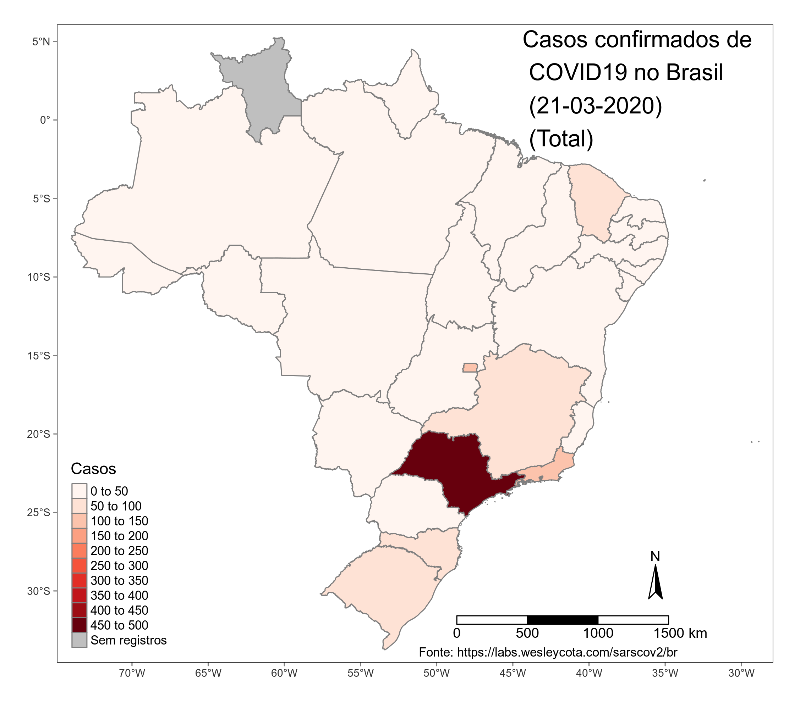
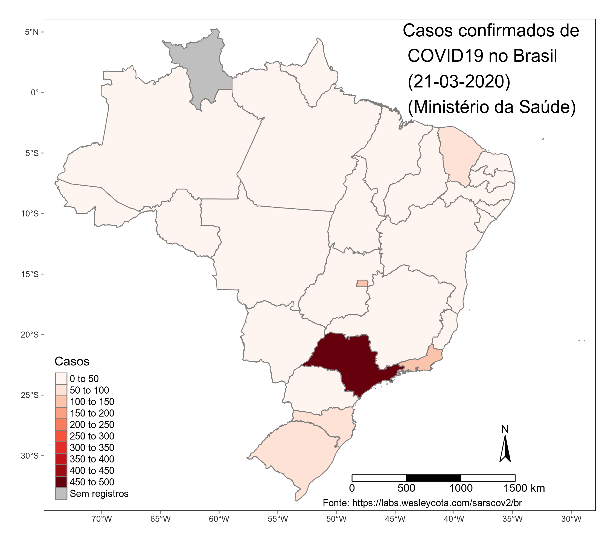
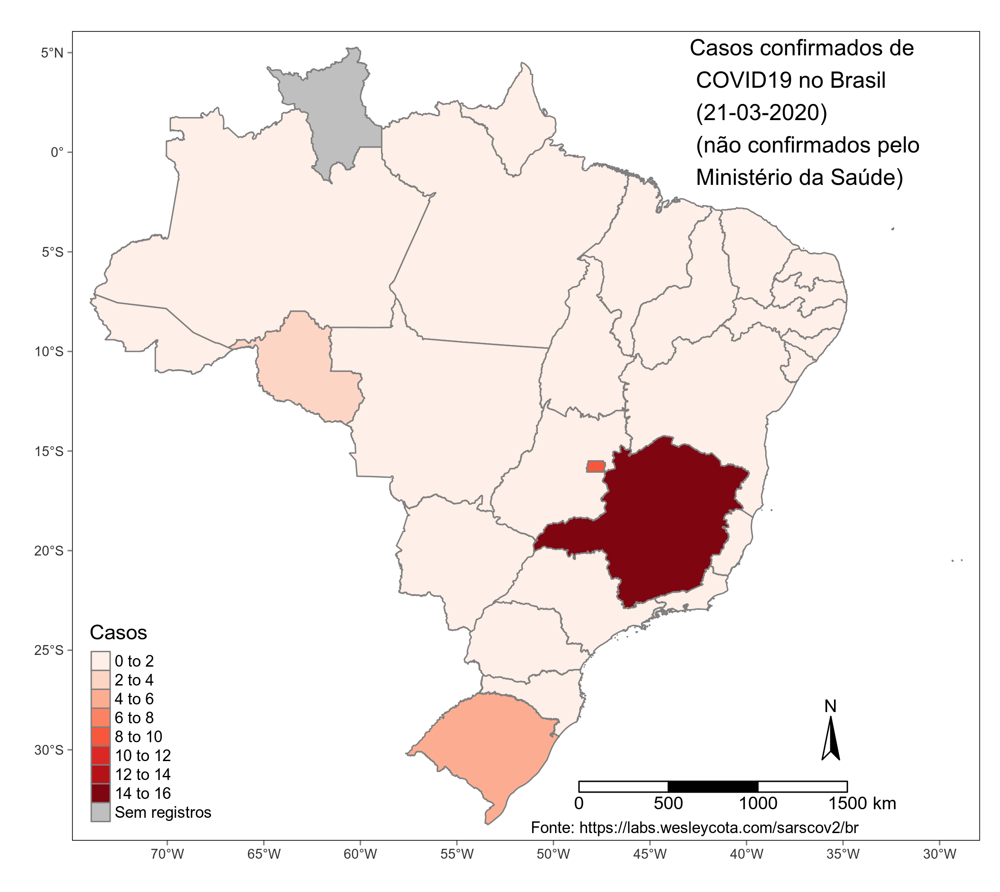

# Coronavírus no Brasil

## Número de casos total por estado do Brasil

## Número de casos confirmados pelo Ministério da Saúde por estado do Brasil

## Número de casos não confirmados pelo Ministério da Saúde por estado do Brasil

## Número de mortes por estado do Brasil

## Número de casos por municípios de São Paulo

## Evolução do número de casos por estado

