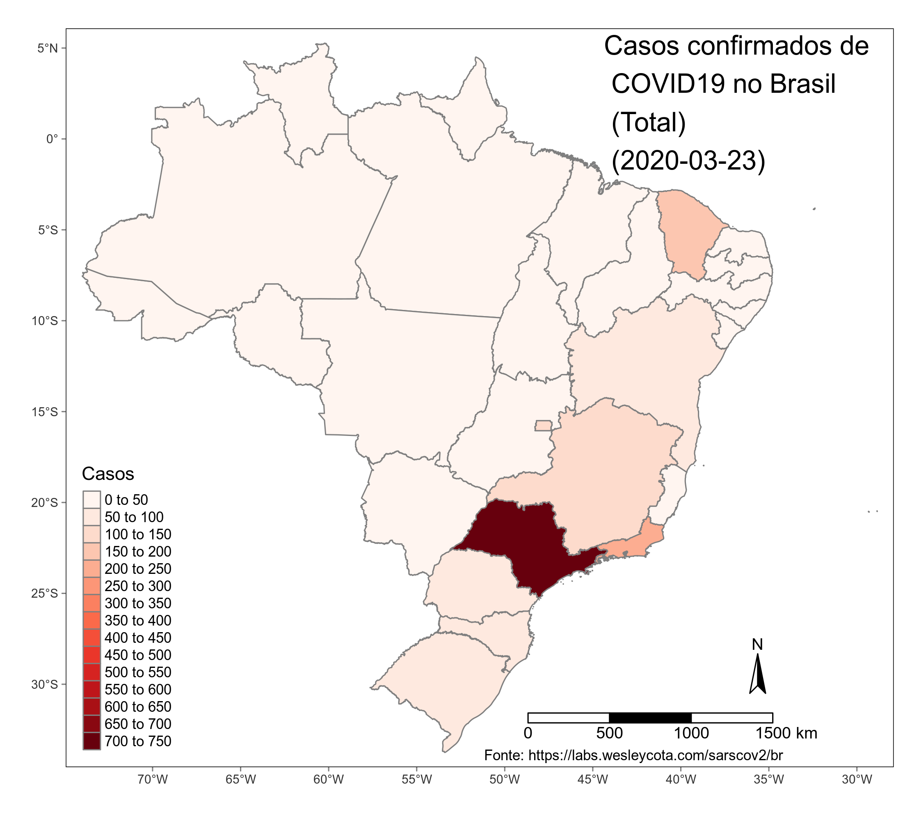
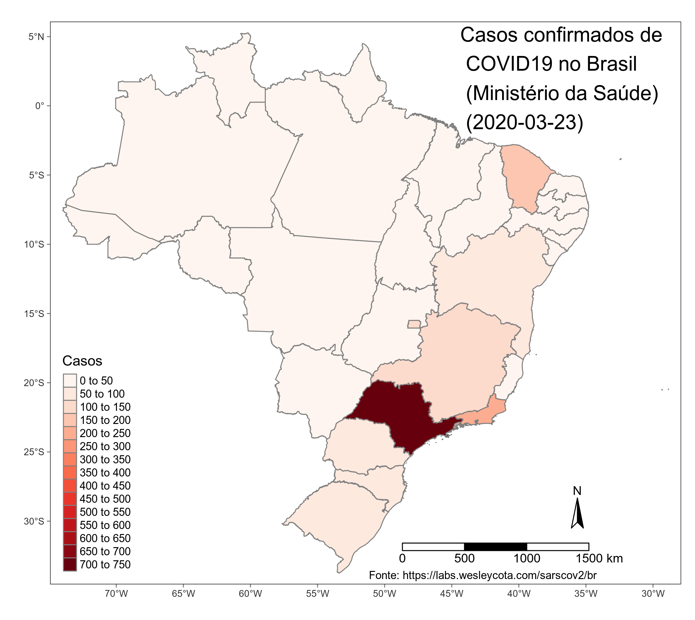
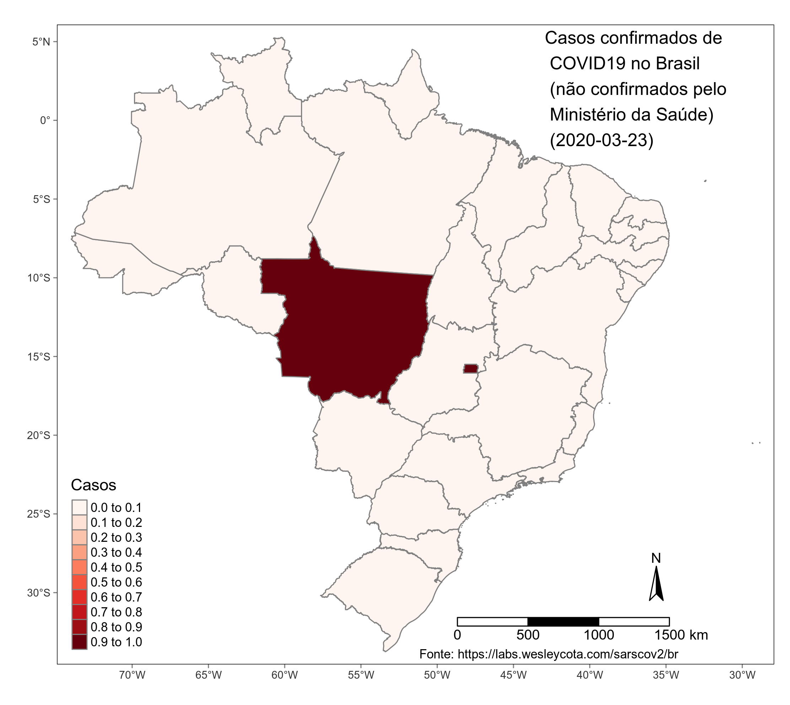
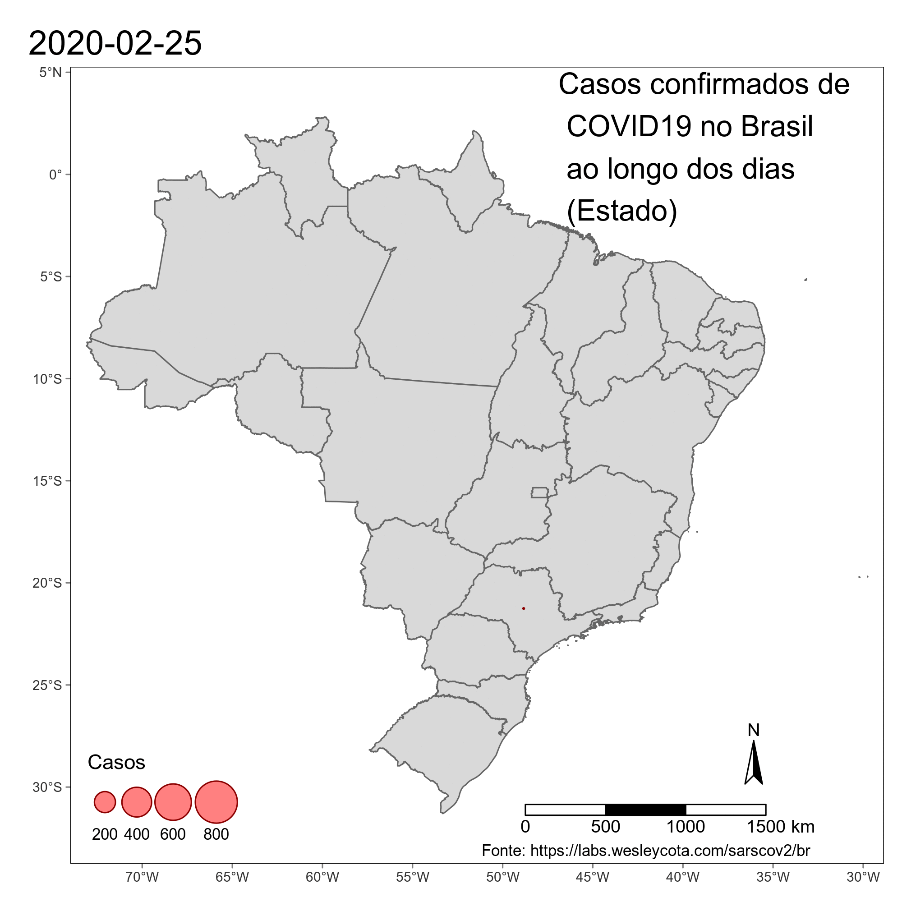

# Coronavírus no Brasil

## Crescimento nacional no número de casos

## Crescimento do número de casos nos estados mais afetados

## Número de casos total por estado do Brasil

## Número de casos confirmados pelo Ministério da Saúde por estado do Brasil

## Número de casos não confirmados pelo Ministério da Saúde por estado do Brasil

## Número de mortes por estado do Brasil

## Número de casos por municípios de São Paulo

## Evolução do número de casos por estado

## Evolução do número de casos por município

## Evolução do número de casos por município de São Paulo
